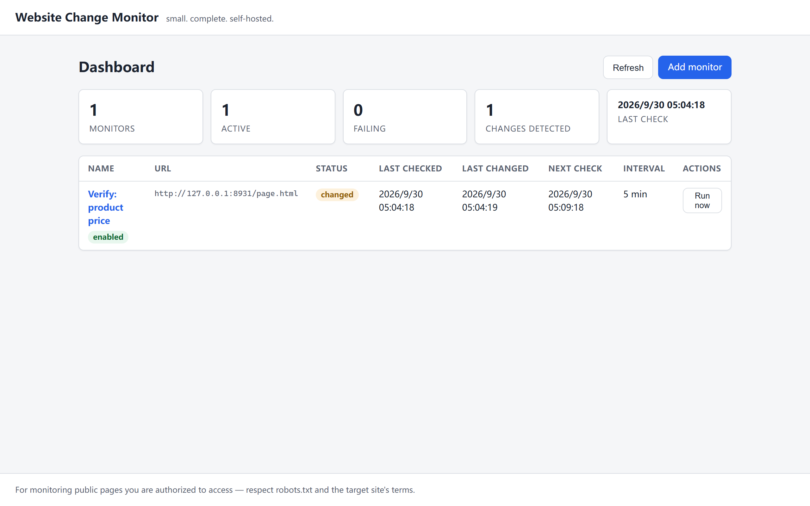
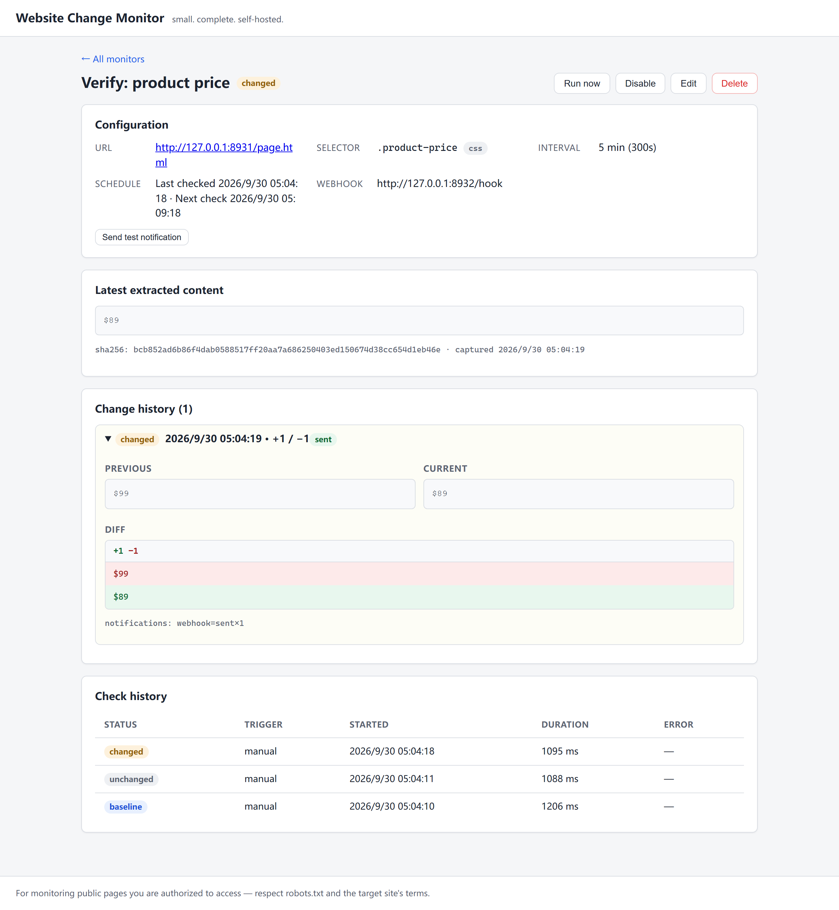
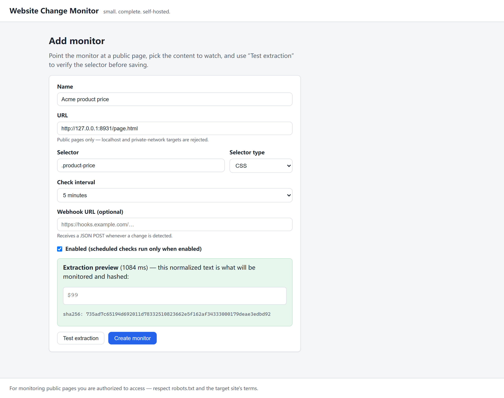

# Website Change Monitor

A small, self-hosted service that watches public web pages for content changes: you give it a URL, a selector for the part you care about, and an interval — it extracts, normalizes, hashes and compares the content on a schedule, records every check in SQLite, and sends a webhook and/or an email when something actually changed.

Built as an independently developed portfolio/reference project — small but complete: real scheduling, real extraction, real history, real notifications, all runnable offline.



## Features

- **Monitors** — create, update, enable/disable, delete, run on demand; each has a URL, a selector, a selector type, a check interval, and optional webhook + email notification targets.
- **Three selector types** — CSS selectors, XPath expressions, and plain-text matching (monitors the lines of the page body containing your text).
- **Playwright-based extraction** — one shared Chromium with crash recovery, isolated context per check, honest user agent, images/media/fonts skipped.
- **Two SSRF protection layers** — a literal-IP URL guard plus DNS resolution checks (A + AAAA, all addresses, fail-closed) at monitor creation, before every check, and for webhook targets.
- **Noise-resistant change detection** — content is normalized (line endings, whitespace, empty lines) then SHA-256 hashed; only semantic changes produce events.
- **Baseline semantics** — the first successful check stores a baseline and never notifies.
- **Correct change history** — every genuinely changed check produces its own change event, including transitions back to previously seen content (A→B→A is real change history, not a duplicate); unchanged polls never produce events or notifications.
- **Check history** — every attempt (success or failure) is recorded with status, duration and a safe error code.
- **Change history with diffs** — line-level added/removed blocks, previous vs current content, notification status per event.
- **Notifications** — webhook provider (JSON POST with bounded retries) and SMTP email provider (compact plain-text change mail), each with delivery records; a failed notification never fails the check.
- **Bounded scheduler** — global concurrency limit, per-monitor re-entrancy guard, restart-safe (state derived from the database), graceful shutdown.
- **Snapshot retention** — `MAX_SNAPSHOTS_PER_MONITOR` prunes old snapshots per monitor; change events are never pruned.
- **Optional API key** — set `APP_API_KEY` to require `Authorization: Bearer <key>` on all API routes except `/health` (timing-safe comparison).
- **Test extraction** — preview exactly what would be monitored before saving a monitor, with no persistence.
- **Web UI** — dashboard with stats, monitor list, detail view with diffs and histories, add/edit forms with extraction preview, API-key unlock prompt, loading/error/empty states, confirmations for destructive actions.
- **Offline demo & offline tests** — `npm run demo` and the whole test suite run against local fixtures, never the internet.

## Use Cases

- Product price / stock changes on public shop pages
- Job postings and announcement pages
- Documentation or policy updates
- Public competitor pages (public information only)
- Any public page where a specific region of text matters

## Architecture

```
                ┌────────────┐
   monitors ───▶│  Scheduler │ every tick: enabled + due + not running
                └─────┬──────┘
                      ▼  bounded queue (MAX_CONCURRENT_CHECKS)
                ┌────────────┐
                │CheckService│ one check_run row per attempt
                └─────┬──────┘
                      ▼
   URL guard + DNS guard → Playwright (shared browser, isolated context)
                      ▼
   extract (css/xpath/text) → normalize → sha256
                      ▼
   compare with latest snapshot
   ├─ first run ────────▶ baseline (no notification)
   ├─ same hash ────────▶ unchanged
   └─ different hash ───▶ snapshot + change event (+ snapshot retention)
                                  │
                                  ▼  async, failure-isolated, per target
                        NotificationService → webhook and/or SMTP email
                                              (or mock, or nothing)
```

Layers: `api/` (Fastify routes, thin) · `services/` (business logic) · `repositories/` (parameterized SQL) · `browser/` (Playwright lifecycle) · `scheduler/` (tick loop + bounded queue) · `notifications/` (provider abstraction) · `db/` (SQLite + numbered migrations). REST API and webhook payloads use snake_case; internal TypeScript uses camelCase.

## Screenshots

| Dashboard | Change history with diff |
| --- | --- |
|  |  |

Test extraction before saving:



## Requirements

- Node.js 22 or 24 (developed on Node 24)
- npm 10+
- Playwright Chromium (installed via `npx playwright install chromium`)
- Docker (optional)

## Installation

```bash
git clone https://github.com/taozhihaoo/website-change-monitor.git
cd website-change-monitor
npm install
npx playwright install chromium
cp .env.example .env   # optional; defaults work out of the box
```

## Quick Start

```bash
npm run dev        # server + API on http://localhost:3000 (serves the built UI)
npm run dev:web    # optional: Vite dev server for UI work (proxies API calls)
```

Production build:

```bash
npm run build
npm start          # serves API + built UI on http://localhost:3000
```

## Demo

Fully offline — starts a local fixture page ($99), checks it (baseline), changes it to $89, detects the change, delivers a mock notification, and shows that repeated identical checks stay quiet:

```bash
npm run demo
```

You can also serve the fixtures manually with `npm run serve:fixture` (http://127.0.0.1:8931) and run `node scripts/e2e-verify.mjs` for a scripted end-to-end verification (26 checks) against a real built server.

## Configuration

All configuration is via environment variables (see `.env.example`). Secrets never go into the database or log output.

| Variable | Default | Purpose |
| --- | --- | --- |
| `APP_PORT` | `3000` | HTTP port |
| `DB_PATH` | `data/wcm.db` | SQLite file (created on demand) |
| `LOG_LEVEL` | `info` | pino level |
| `BROWSER_HEADLESS` | `true` | Chromium headless mode |
| `MAX_CONCURRENT_CHECKS` | `5` | Global concurrency limit |
| `DEFAULT_TIMEOUT` | `30000` | Page load/extraction budget (ms) |
| `EXTRACTION_SETTLE_MS` | `1000` | Extra wait for rendering after load |
| `SCHEDULER_TICK_MS` | `10000` | Scheduler tick interval |
| `WEBHOOK_TIMEOUT_MS` | `8000` | Webhook request timeout |
| `WEBHOOK_MAX_ATTEMPTS` | `3` | Webhook retry attempts (5xx/429/network only) |
| `DNS_TIMEOUT_MS` | `5000` | DNS resolution guard timeout |
| `MAX_SNAPSHOTS_PER_MONITOR` | `100` | Retention per monitor (0 = unlimited) |
| `APP_API_KEY` | unset | Require `Authorization: Bearer <key>` (≥ 16 chars); unset = no auth |
| `ALLOW_PRIVATE_TARGETS` | `false` | Allow localhost/private URLs — **for local dev/demo/tests only** |
| `DEFAULT_NOTIFICATION_PROVIDER` | `none` | Provider when a monitor has neither webhook nor email: `none` \| `mock` |
| `SMTP_HOST` / `SMTP_PORT` / `SMTP_USER` / `SMTP_PASSWORD` / `SMTP_FROM` / `SMTP_SECURE` | unset | Email provider; enabled only when `SMTP_HOST` is set (`SMTP_FROM` required then) |

## Creating a Monitor

Via the UI ("Add monitor") or the API. Always use **Test extraction** first — it shows the exact normalized text that will be monitored and persists nothing.

## Selectors

| Type | Example | Meaning |
| --- | --- | --- |
| `css` | `.product-price` | Inner text of every matching element, joined |
| `xpath` | `//div[@class="price"]` | Same, located via XPath |
| `text` | `$99` | All lines of the page body containing the text |

Failure modes are explicit error codes: `SELECTOR_NOT_FOUND`, `TEXT_NOT_FOUND`, `EMPTY_EXTRACTION`, `TIMEOUT`, `NAVIGATION_ERROR`, `NETWORK_ERROR`, `DNS_ERROR` — a failed check never disables a monitor.

## Scheduling

Intervals are per-monitor seconds (UI presets: 5 min … 24 h; API accepts ≥ 60 s). The scheduler ticks every `SCHEDULER_TICK_MS`, dispatching enabled monitors whose last run (success **or** failure) is older than their interval — failures count toward the interval, preventing error storms. A monitor is never checked twice in parallel; checks run through a bounded queue (`MAX_CONCURRENT_CHECKS`); manual runs jump the queue via `POST /monitors/:id/run`. After a restart the scheduler simply resumes — due-ness is derived from the database, not from memory (covered by a restart integration test). Shutdown drains the queue, closes the browser and the database.

## Change Detection

1. Every successful check stores a snapshot (extracted text, SHA-256, timestamp); snapshots beyond `MAX_SNAPSHOTS_PER_MONITOR` are pruned (newest kept; change events are never pruned).
2. First check → `baseline`, no event, no notification.
3. Same hash as the previous snapshot → `unchanged` — this is what keeps repeated polling quiet (no events, no notifications).
4. Different hash → `changed`: snapshot + change event (previous/current content, hashes, line diff) + notifications. **Every** hash transition produces its own event, including returns to previously seen content: A→B→A records two events, and a later A→B is a new change again — the history reflects what actually happened to the page.
5. Notifications are asynchronous: `changed → DB saved → webhook failed` still ends with a successful check and a failed delivery record.

## Notifications

`NotificationProvider` abstraction with three implementations. A monitor can configure **both** a webhook and an email address; each target gets its own delivery record and retry budget.

- **webhook** — POSTs the JSON payload below; retries on network errors, timeouts, 5xx and 429 (up to `WEBHOOK_MAX_ATTEMPTS`, exponential backoff), no retry on other 4xx. Delivery rows store the complete endpoint (path + query) so history shows what was actually called; the API masks targets to their origin so secret paths/tokens are not exposed. Test it with `POST /monitors/:id/test-notification`.
- **email** (optional) — compact plain-text change mail via SMTP (nodemailer) when `SMTP_HOST` is configured: monitor name, URL, detected time, hashes, diff summary and a bounded changed-lines excerpt — never the full snapshot. Auth failures are not retried; transport failures are. Monitors opt in via their notification email address.
- **mock** — logs the payload; used by the demo/tests and via `DEFAULT_NOTIFICATION_PROVIDER=mock` when a monitor has neither target configured.

```json
{
  "event": "content_changed",
  "monitor_id": "…",
  "monitor_name": "Acme product price",
  "url": "https://example.com/product",
  "detected_at": "2026-09-30T05:04:19.343Z",
  "previous_hash": "735ad7c6…",
  "current_hash": "bcb852ad…",
  "diff": { "added": 1, "removed": 1, "changes": [ … ] }
}
```

## REST API

When `APP_API_KEY` is set, all routes below except `GET /health` require `Authorization: Bearer <key>` (401 otherwise).

| Method & Path | Purpose |
| --- | --- |
| `GET /health` | Liveness + scheduler snapshot (always public) |
| `GET /scheduler/status` | Active/queued checks, running monitors |
| `GET /stats` | Dashboard aggregates |
| `GET /monitors` | List with last check / last change / next check |
| `POST /monitors` | Create (validated, URL + DNS guarded) → 201 |
| `GET /monitors/:id` | Detail with summary fields |
| `PATCH /monitors/:id` | Partial update |
| `DELETE /monitors/:id` | Delete (cascades history) → 204 |
| `POST /monitors/:id/run` | Run now → 202 queued; `?wait=1` waits for the result |
| `GET /monitors/:id/runs` | Check history (paged) |
| `GET /monitors/:id/snapshots` | Snapshot history (paged) |
| `GET /monitors/:id/changes` | Change events incl. diff + deliveries |
| `GET /monitors/:id/notifications` | Notification deliveries |
| `POST /monitors/:id/test-notification` | Test all configured targets → `{ results: [...] }` |
| `POST /monitors/test-extraction` | Preview extraction — persists nothing |

Errors use one envelope and never leak stack traces:

```json
{ "error": { "code": "VALIDATION_ERROR", "message": "Request validation failed.", "details": { … } } }
```

`400` validation / blocked URL / DNS resolution refused · `401` missing or wrong API key · `404` unknown monitor · `409` monitor already checking · `413` oversized body · `422` extraction failures · `500` safe internal error with a request id.

## Data Model

```
monitors(id, name, url, selector, selector_type, check_interval_seconds,
         enabled, webhook_url, notify_email, created_at, updated_at)
snapshots(id, monitor_id→, content_hash, content, checked_at)         -- pruned to MAX_SNAPSHOTS_PER_MONITOR
change_events(id, monitor_id→, previous_hash, current_hash,
              previous_content, current_content, diff_json, detected_at)  -- full history, never pruned
check_runs(id, monitor_id→, triggered_by, status, error_code, error_message,
           duration_ms, started_at, finished_at)
notification_deliveries(id, change_event_id→, monitor_id→, provider, target,
                        status, attempts, last_error, created_at, updated_at)
schema_migrations(version, applied_at)
```

Schema is created by numbered, transactional migrations embedded in the server (migration 2 rebuilt `change_events` to drop an over-restrictive uniqueness constraint from v1 — existing data is preserved). All SQL is parameterized; foreign keys cascade on delete.

## Testing

129 offline tests (Vitest) — no internet, no real target sites, no real SMTP:

```bash
npm test                 # 105 unit tests: url+dns guards, normalize/hash/diff,
                         # pipeline semantics (A→B→A→B regression), email
                         # provider (injected transport), retention, retries,
                         # scheduler, queue, serializers, CRUD, migrations
npm run test:integration # 24 integration tests: real Chromium + local fixture
                         # server + real SQLite + HTTP API (fastify inject),
                         # API-key protection, scheduler restart recovery,
                         # browser crash relaunch
npm run check            # lint + typecheck + unit tests
node scripts/e2e-verify.mjs  # scripted 26-check E2E against a real built server
```

## Docker

```bash
docker compose up --build
```

Multi-stage build (Node 24 slim): compiles server + client, prunes dev dependencies, installs Chromium, runs as a non-root `app` user, keeps SQLite in the `wcm-data` named volume, exposes a `/health`-based HEALTHCHECK.

**Docker files provided but not locally verified** (no Docker on the development machine). CI builds and tests the project itself on every push.

## CI

GitHub Actions (`.github/workflows/ci.yml`) runs on Node 22 and 24: install → Playwright Chromium → lint → typecheck → unit tests → integration tests (offline) → build.

## Security

- **Layer 1 — literal URL guard**: only public http(s) URLs; rejects credentials-in-URL, localhost, `.local/.internal/…`, loopback/private/link-local/CGNAT IPv4 (incl. IPv4-mapped IPv6), IPv6 loopback/unspecified/ULA/link-local.
- **Layer 2 — DNS resolution guard**: hostnames are resolved (A + AAAA) at monitor create/update, before every check, and for webhook targets; if **any** resolved address is private/reserved the request fails closed with a safe error. Resolution failures produce `DNS_ERROR` without resolver internals.
- **Authentication model** — this is a single-user / self-hosted tool. With `APP_API_KEY` set, every API route except `/health` requires a Bearer key (timing-safe comparison, key never logged or echoed, identical 401 for missing vs wrong key, the UI stores it in the browser and shows an unlock prompt). With no key configured the server is open on its interface — bind it to a trusted network or put a reverse proxy in front.
- Parameterized SQL everywhere; unified error envelope without stack traces; request ids on internal errors.
- Secrets only via environment variables; webhook targets masked in API responses (full endpoint kept in the local database for auditability); pino redaction list for credential-ish fields; SMTP credentials used only to build the transport.

## Responsible Use

This tool is for monitoring **public pages or resources you are authorized to access**. You are responsible for complying with the target site's robots.txt, Terms of Service, rate limits and applicable law. The default cadence is deliberately conservative (minutes, not seconds), requests identify themselves with an honest user agent, and the project intentionally implements **no** CAPTCHA bypass, anti-bot bypass, proxy rotation, fingerprint spoofing, stealth scraping or Cloudflare bypass. It is a monitoring utility, not an evasion tool.

## Limitations

Honest list — please read before relying on this:

- **No multi-user auth** — `APP_API_KEY` is a single shared key for one operator; there are no users, roles or sessions.
- **DNS TOCTOU / rebinding** — the DNS guard resolves before the browser connects; an adversarial DNS server can still return different answers per lookup. Infrastructure-level controls (egress filtering) remain the complete answer.
- **No CAPTCHA / anti-bot handling** — by design. Sites that block bots will simply yield `NAVIGATION_ERROR`/`NETWORK_ERROR`/`DNS_ERROR`.
- **No distributed workers** — one process, one browser, one SQLite file.
- **SQLite is intended for lightweight deployments** (single node, modest scale).
- **Browser-based extraction breaks when page structure changes** — selectors are fragile by nature; the error history helps you notice.
- **Idempotency is per transition** — repeated identical polls stay quiet, but each real change notifies once; if content flaps A→B→A→B you get three notifications, by design.
- **Email delivery needs a reachable SMTP server** — no built-in queue beyond the per-notification retry budget; if the server is down for longer the email for that event is recorded as failed and not re-sent later.
- **Monitors public/authorized content only** — see Responsible Use.

## Project Structure

```
website-change-monitor/
├── src/                    # server (TypeScript, ESM, strict)
│   ├── api/                # Fastify app, auth hook, routes, schemas, error envelope
│   ├── browser/            # shared-Chromium BrowserManager with crash recovery
│   ├── config/             # zod-validated environment config
│   ├── db/                 # better-sqlite3, numbered migrations
│   ├── domain/             # entities + AppError codes
│   ├── notifications/      # provider abstraction, webhook, SMTP email, mock
│   ├── repositories/       # parameterized SQL data access + snapshot pruning
│   ├── scheduler/          # tick loop + bounded queue
│   ├── services/           # monitor, check pipeline, extraction, diff
│   └── utils/              # url guard, dns guard, hash, normalize, logger, clock
├── client/                 # React 19 + Vite + TypeScript SPA
│   └── src/{api,components,pages}
├── fixtures/               # site-v1.html / site-v2.html (offline demo)
├── scripts/                # demo, fixture server, E2E verification
├── test/unit/              # 105 unit tests
├── test/integration/       # 24 integration tests (real browser, offline)
└── docs/screenshots/       # real screenshots from a running instance
```

## Roadmap

- Snapshot retention window (age-based, in addition to count-based)
- Per-monitor normalization options (e.g. ignore numbers)
- Docker image publication
- Optional digest emails (daily summary of all changes)

## License

MIT
